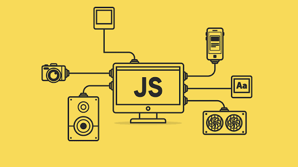
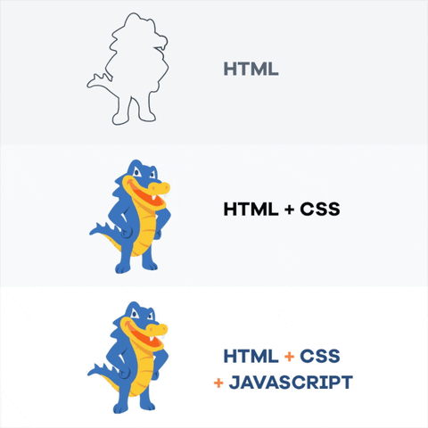

### Linguagem JavaScript ### 

#### Introdução ####

A linguagem de programação JavaScript, é uma linguagem que permite a criação de páginas web interativas, com a possibilidade de aplicar animações, menus e atualizações. 


JavaScript é uma linguagem de programação interpretada estruturada, de script em alto nível com tipagem dinâmica fraca e multiparadigma. Juntamente com HTML e CSS, o JavaScript é uma das três principais tecnologias da World Wide Web. 

O JavaScript é uma linguagem de programação interpretada que permite criar conteúdo dinâmico, controlar multimédia, animar imagens e praticamente tudo o que envolve interatividade num site ou aplicação. 

Para perceber melhor o papel do JavaScript na internet, a melhor analogia é com a construção de uma casa:

HTML: É a estrutura base (paredes, telhado).

CSS: É a decoração e o design (pintura, móveis). 

JavaScript: É a parte elétrica e hidráulica, ou seja, o que torna a casa funcional, interativa e inteligente. 

### Para que serve? ###

Hoje em dia, a grande maioria dos sites utiliza JavaScript. As suas funções mais comuns incluem:

Interatividade em tempo real: Atualização de feeds de redes sociais sem precisar recarregar a página, validação de formulários (como verificar se um email foi digitado corretamente) e menus dinâmicos. 

Animações e Efeitos Visuais: Criação de galerias de imagens, carrosséis, pop-ups e elementos que se movem ou reagem quando o utilizador clica ou passa o rato.

Aplicações Web Complexas: Criação de plataformas inteiras dentro do navegador, como o Google Maps ou o leitor de vídeos da Netflix. 

Aplicações Mobile e Servidores: Embora tenha nascido para os navegadores de internet, hoje o JavaScript também é usado para criar aplicações para telemóveis (através de estruturas como o React Native) e para programar a parte lógica dos servidores (através do Node.js).

### Quem criou esta linguagem ###

Brendan Eich, nascido em 4 de julho de 1961) é um tecnólogo e programador de computadores americano.[1] Ele é o criador da linguagem de programação JavaScript e cofundador do projeto Mozilla, da Mozilla Foundation e da Mozilla Corporation.[2] Eich serviu brevemente como CEO da Mozilla Corporation antes de renunciar devido a controvérsias políticas. Atualmente, é o CEO da Brave Software, empresa que desenvolve o navegador focado em privacidade Brave e a criptomoeda Basic Attention Token (BAT).

### Em que ano foi criada ### 

Em maio de 1995, a primeira versão foi feita em apenas dez dias, sendo lançada oficialmente no final desse mesmo ano. 

### Para que tipo de aplicações é mais utilizada? ###

Principais Aplicações Desenvolvimento Web Front-End: 

Criação de sites interativos, animações, jogos de navegador e atualizações de páginas em tempo real.Desenvolvimento Web Back-End: Construção de servidores e APIs robustas para gerir bases de dados através do ambiente Node.js.Aplicações Móveis: Criação de aplicações para Android e iOS usando o mesmo código através de frameworks como React Native. 





### Exemplos de código ###

``1. Mostrar uma mensagem``
```console.log("Olá, mundo!");```

```2. Variáveis```

```let nome = "João";```
```const idade = 25;```

```console.log(nome);```

```console.log(idade);```

```3. Função```

```function somar(a, b) {```
  ```return a + b;```


```console.log(somar(5, 3));```

```4. Condicional (if/else)```
```let nota = 18;```

```if (nota >= 10) {```
  ```console.log("Aprovado");```
} ```else {```
  ```console.log("Reprovado");```

```5. Ciclo for```
```for (let i = 1; i <= 5; i++) {```
  ```console.log(i);```

```6. Array```
```const frutas = ["Maçã", "Banana", "Laranja"];```

```frutas.forEach(fruta =>```
  ```console.log(fruta);```

```7. Objeto```
```const pessoa =```
  ```nome: "Ana",```
  ```idade: 30```


```console.log(pessoa.nome);```
```console.log(pessoa.idade);```
`
```8. Manipular um elemento HTML```
```<button onclick="mudarTexto()">Clique aqui</button>```

```<p id="texto">Texto original</p>```

```<script>```
```function mudarTexto()```
  ```document.getElementById("texto").textContent = "Texto alterado!";```

```</script>```

```9. Função assíncrona```
```function buscarDados()```
  ```resposta = await fetch("https://jsonplaceholder.typicode.com/posts/1");```
  ```const dados = await resposta.json();```
  ```console.log(dados);```
}

```buscarDados();```

```10.  Gerar um número aleatório```
```const numero = Math.floor(Math.random() * 100) + 1;```
```console.log(numero);```


## ##


